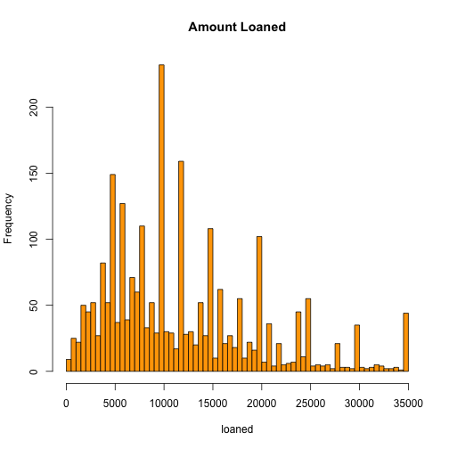
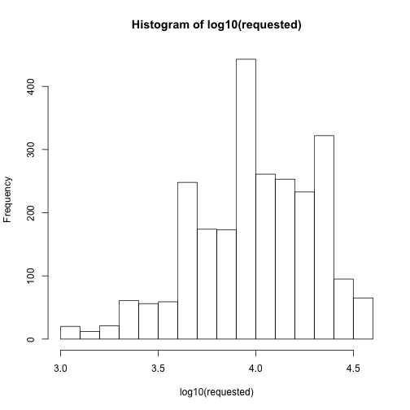
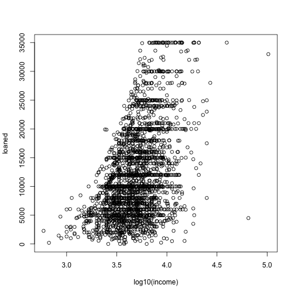
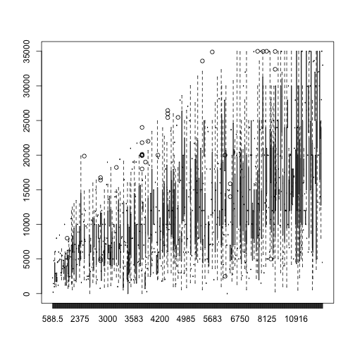
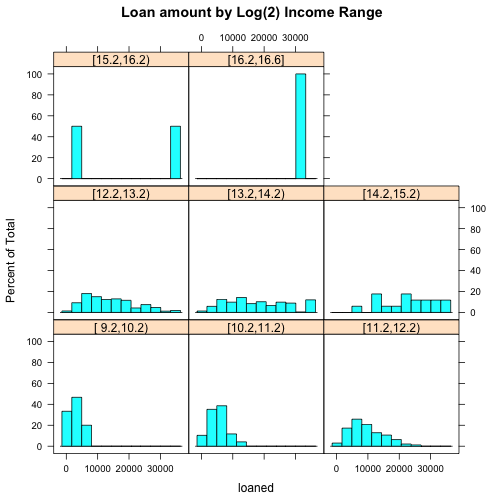
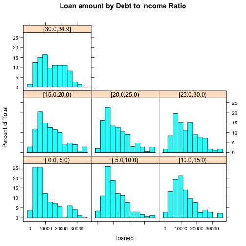

R loans markdown tests
========================================================
#### Load required libraries

```r
require(plyr)
require(Hmisc)
require(lattice)
require(RColorBrewer)
```


### read in preprocessed data 

```r
loans <- read.csv("~/Desktop/RCourse/DataAnalysis/AnalysisAssignment1/Rproject/ProcessedData/Working/loans.csv")
data <- read.csv("~/Desktop/RCourse/DataAnalysis/AnalysisAssignment1/Rproject/ProcessedData/Working/data.csv")
```


### dimensions of data

```r
dim(loans)
```

```
## [1] 2498   15
```

```r
dim(data)
```

```
## [1] 2500   15
```

### Describe loans -- noticed that summary doesn't show loan amount of -0.01 in two rows. 

```r
summary(loans)
```

```
##        X            requested         loaned         interest    
##  Min.   :    10   Min.   : 1000   Min.   :    0   Min.   : 5.42  
##  1st Qu.: 26503   1st Qu.: 6000   1st Qu.: 6000   1st Qu.:10.16  
##  Median : 50618   Median :10000   Median :10000   Median :13.11  
##  Mean   : 51592   Mean   :12413   Mean   :12009   Mean   :13.07  
##  3rd Qu.: 77543   3rd Qu.:17000   3rd Qu.:16000   3rd Qu.:15.80  
##  Max.   :104202   Max.   :35000   Max.   :35000   Max.   :24.89  
##                                                                  
##      length                   purpose         debts           state     
##  Min.   :36.0   debt_consolidation:1307   Min.   : 0.00   CA     : 433  
##  1st Qu.:36.0   credit_card       : 444   1st Qu.: 9.75   NY     : 253  
##  Median :36.0   other             : 199   Median :15.32   TX     : 174  
##  Mean   :41.3   home_improvement  : 152   Mean   :15.39   FL     : 169  
##  3rd Qu.:36.0   major_purchase    : 101   3rd Qu.:20.68   IL     : 101  
##  Max.   :60.0   small_business    :  87   Max.   :34.91   GA     :  98  
##                 (Other)           : 208                   (Other):1270  
##        home          income            fico         o.credit   
##  MORTGAGE:1148   Min.   :   588   670-674: 171   Min.   : 2.0  
##  OTHER   :   5   1st Qu.:  3500   675-679: 166   1st Qu.: 7.0  
##  OWN     : 200   Median :  5000   680-684: 157   Median : 9.0  
##  RENT    :1145   Mean   :  5685   695-699: 153   Mean   :10.1  
##                  3rd Qu.:  6800   665-669: 145   3rd Qu.:13.0  
##                  Max.   :102750   690-694: 140   Max.   :38.0  
##                                   (Other):1566                 
##     r.credit        inquiries          employed  
##  Min.   :     0   Min.   :0.000   10+ years:653  
##  1st Qu.:  5586   1st Qu.:0.000   < 1 year :248  
##  Median : 10962   Median :0.000   2 years  :244  
##  Mean   : 15245   Mean   :0.906   3 years  :235  
##  3rd Qu.: 18889   3rd Qu.:1.000   5 years  :202  
##  Max.   :270800   Max.   :9.000   4 years  :192  
##                                   (Other)  :724
```

```r
range(loans$loaned)
```

```
## [1]    -0.01 35000.00
```

```r
subset(loans, loaned == -0.01)
```

```
##           X requested loaned interest length     purpose debts state
## 401  102441      7500  -0.01    12.29     36 educational 21.34    CA
## 1631 102444      2200  -0.01    13.87     36 credit_card 10.35    NJ
##          home income    fico o.credit r.credit inquiries employed
## 401  MORTGAGE   8750 685-689       14    20947         7  5 years
## 1631     RENT   3333 640-644       10    11606         1  3 years
```


### dropping rows from loaned that show loan amount < 0 (assuming this must be error)

```r
min(loans$loaned)
```

```
## [1] -0.01
```

```r
loans <- loans[loans$loaned >= 0, ]
min(loans$loaned)
```

```
## [1] 0
```


### Break income down into ranges

```r
attach(loans)
range(income)
```

```
## [1]    588.5 102750.0
```

```r
inc.low <- floor(min(income))
inc.high <- ceiling(max(income))
######## add log income 2 as factor
log.income <- log2(loans$income)
l.inc.low <- min(log.income)  ### min of log income
l.inc.high <- max(log.income)
income.groups2 <- cut2(log.income, seq(l.inc.low, l.inc.high, by = 1))
loans$log2.inc.range <- as.factor(income.groups2)
head(loans)
```

```
##       X requested loaned interest length            purpose debts state
## 1 81174     20000  20000     8.90     36 debt_consolidation 14.90    SC
## 2 99592     19200  19200    12.12     36 debt_consolidation 28.36    TX
## 3 80059     35000  35000    21.98     60 debt_consolidation 23.81    CA
## 4 15825     10000   9975     9.99     36 debt_consolidation 14.30    KS
## 5 33182     12000  12000    11.71     36        credit_card 18.78    NJ
## 6 62403      6000   6000    15.31     36              other 20.05    CT
##       home income    fico o.credit r.credit inquiries employed
## 1 MORTGAGE   6542 735-739       14    14272         2 < 1 year
## 2 MORTGAGE   4583 715-719       12    11140         1  2 years
## 3 MORTGAGE  11500 690-694       14    21977         1  2 years
## 4 MORTGAGE   3833 695-699       10     9346         0  5 years
## 5     RENT   3195 695-699       11    14469         0  9 years
## 6      OWN   4892 670-674       17    10391         2  3 years
##   log2.inc.range
## 1    [12.2,13.2)
## 2    [11.2,12.2)
## 3    [13.2,14.2)
## 4    [11.2,12.2)
## 5    [11.2,12.2)
## 6    [12.2,13.2)
```

```r
### income to debt range as factor
head(loans)
```

```
##       X requested loaned interest length            purpose debts state
## 1 81174     20000  20000     8.90     36 debt_consolidation 14.90    SC
## 2 99592     19200  19200    12.12     36 debt_consolidation 28.36    TX
## 3 80059     35000  35000    21.98     60 debt_consolidation 23.81    CA
## 4 15825     10000   9975     9.99     36 debt_consolidation 14.30    KS
## 5 33182     12000  12000    11.71     36        credit_card 18.78    NJ
## 6 62403      6000   6000    15.31     36              other 20.05    CT
##       home income    fico o.credit r.credit inquiries employed
## 1 MORTGAGE   6542 735-739       14    14272         2 < 1 year
## 2 MORTGAGE   4583 715-719       12    11140         1  2 years
## 3 MORTGAGE  11500 690-694       14    21977         1  2 years
## 4 MORTGAGE   3833 695-699       10     9346         0  5 years
## 5     RENT   3195 695-699       11    14469         0  9 years
## 6      OWN   4892 670-674       17    10391         2  3 years
##   log2.inc.range
## 1    [12.2,13.2)
## 2    [11.2,12.2)
## 3    [13.2,14.2)
## 4    [11.2,12.2)
## 5    [11.2,12.2)
## 6    [12.2,13.2)
```

```r
range(debts)
```

```
## [1]  0.00 34.91
```

```r
debt.range <- cut2(debts, seq(min(debts), max(debts), by = 5))
loans$debt.range <- as.factor(debt.range)
table(debt.range)
```

```
## debt.range
## [ 0.0, 5.0) [ 5.0,10.0) [10.0,15.0) [15.0,20.0) [20.0,25.0) [25.0,30.0) 
##         236         408         567         584         450         178 
## [30.0,34.9] 
##          73
```

```r
detach(loans)
```


### Some exploratory

```r
attach(loans)
```

```
## The following object(s) are masked _by_ '.GlobalEnv':
## 
##     debt.range
```

```r
hist(loaned, breaks = 100, main = "Amount Loaned", col = "orange")
```

 

```r
hist(log10(requested))
```

 

```r
plot(loaned ~ log10(income))
```

 

```r
boxplot(loaned ~ income)  ### not very informative
```

 

```r
histogram(~loaned | log2.inc.range, main = "Loan amount by Log(2) Income Range")
```

 

```r
histogram(~loaned | debt.range, main = "Loan amount by Debt to Income Ratio")
```

 

```r

detach(loans)
```

